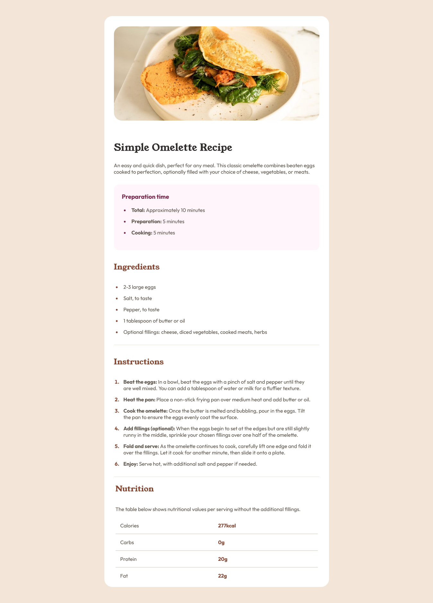

# Frontend Mentor - Recipe page solution

This is a solution to the [Recipe page challenge on Frontend Mentor](https://www.frontendmentor.io/challenges/recipe-page-KiTsR8QQKm). Frontend Mentor challenges help you improve your coding skills by building realistic projects. 

## Table of contents

- [Overview](#overview)
  - [The challenge](#the-challenge)
  - [Screenshot](#screenshot)
  - [Links](#links)
- [My process](#my-process)
  - [Built with](#built-with)
  - [What I learned](#what-i-learned)
  - [Continued development](#continued-development)
- [Author](#author)

## Overview

### Screenshot



### Links

- Solution URL: [https://github.com/Ojay16/Recipe_page.git]
- Live Site URL: [https://ojay16.github.io/Recipe_page/]

## My process

### Built with

- Semantic HTML5 markup
- CSS custom properties
- Flexbox
- Mobile-first workflow

### What I learned

What I learnt from this Challenge is, how to easily use Flexbox to align contents of my table. using the `flex: 1;` property.

```css
.nutrition-list li {
    flex: 1; 
    text-align: left;
}
```

### Continued development

I plan to work on my Flexbox knowledge. so i can develop my flexbox skills, and use it more effectively.

## Author

- Website - [Julius Ojemare](https://ojay16.github.io/Portfolio/)
- Frontend Mentor - [@Ojay16](https://www.frontendmentor.io/profile/Ojay16)
- Twitter - [@Ojay_Of_Esan](https://x.com/Ojay_Of_Esan)